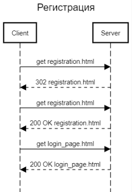
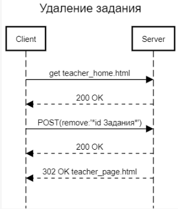
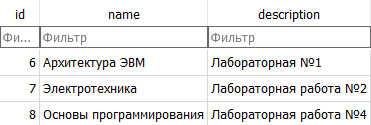
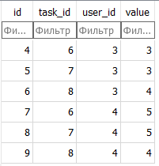
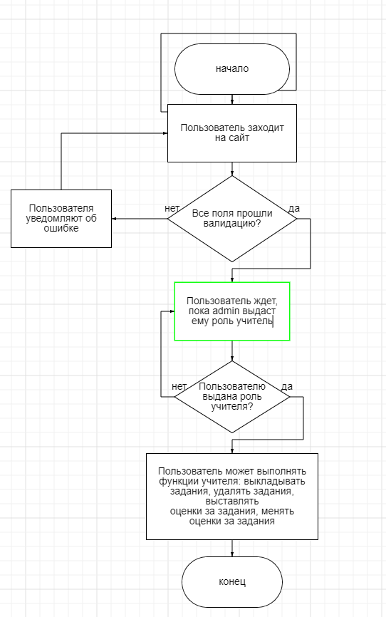
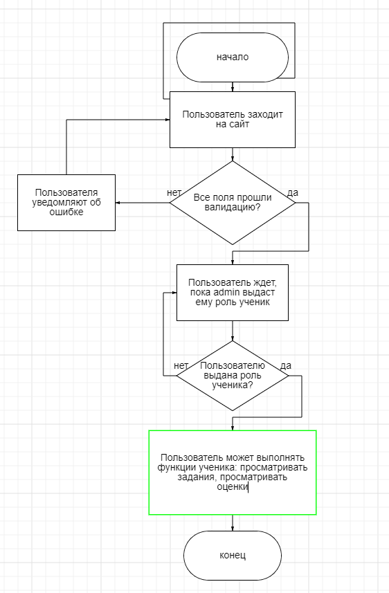

**Отчет о курсовой работе**

По курсу “Основы Программирования”

Работу выполнил студент группы №3136 Скорняков С.С.

**Изучение предметной области!

**

Журнал успеваемости учащихся. Админский интерфейс позволяет добавлять преподавателей и учеников. Учителя выкладывают задания и выставляют оценки, ученики могут их смотреть.

**Составление ТЗ!

**

Возможности учеников:

- Просматривать задания
- Просматривать оценки

Возможности учителей:

- Создавать задания
- Удалять задания
- Выставлять оценки
- Менять оценки

**Реализация!

**

Пользовательский интерфейс:

Стартовая страница:

Страница регистрации:

Страница входа:

Страница преподавателя:

Страница студента:

Примеры HTTP-запросов:

Пример запроса при регистрации пользователя:

**

** Пример запроса при удалении задания преподавателем:
**

Описание структуры базы данных:

Для хранения данных в БД используется sqlite3. Данные о пользователях, задания, оценки хранятся в трех таблицах.

В первой таблице хранятся данные о пользователях:

Во второй таблице хранятся данные о заданиях:

В третьей таблице хранятся данные об оценках:

Блок-схемы алгоритмов:

Блок-схема алгоритма для учителя:

Блок-схема алгоритма для ученика:

